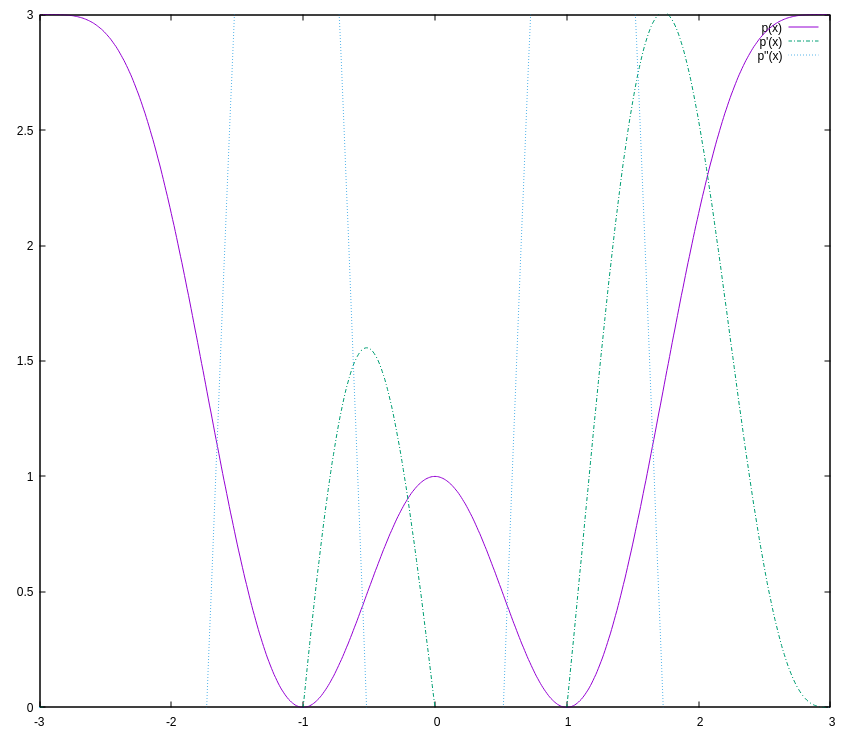

# superpoly

This produces a polynomial with the following:
 - p(x) = p(-x)
 - p(1) = 0
 - p'(1) = 0
 - p'(3) = 0
 - p(0) = h_0
 - p(3) = h_1
and then, for an arbitrary number of points it is possible to specify the second derivative to fix oscillating issues

The polynomial has the following form:

p(x) = a_2 (x^2-1)^2 + a_3 (x^2-1)^3 + ...

# example run

```
cargo run <<< '1
3
5
3
0
4.55
0.0
4.3
0
5.02
9
7.1
90
' > out
```

beginning of the output:

```
Input height at 0 and height at 3
Input number of second derivative points 
Input second derivative point positions and values

  ┌                                                                                                                                                         ┐
  │                  1                 -1                  1                 -1                  1                 -1                  1                 -1 │
  │                 64                512               4096              32768             262144            2097152           16777216          134217728 │
  │                 16                192               2048              20480             196608            1835008           16777216          150994944 │
  │                104               2112              31744             409600            4816896           53215232          562036736         5737807872 │
  │ 244.42999999999995 12118.515187499996  446936.9547858748  14173991.19816581  409987664.4970896 11145105246.949165  289708521924.1584  7280443298965.557 │
  │             217.88  9596.762999999999      314293.998744  8849753.826120896 227263418.13746658 5484623281.6499405 126566365335.34087   2823599850020.23 │
  │  298.4047999999999 18150.590404799994  821810.3329461791 32003575.015241113 1136846989.6680145 37954550501.015434 1211723444448.7136  37400012122151.61 │
  │             600.92  74426.28299999998  6872297.247575998  546066409.8533047  39588234404.03694  2697734075404.558 175809497538346.47  11077328274560740 │
  └                                                                                                                                                         ┘


  ┌    ┐
  │  1 │
  │  3 │
  │  0 │
  │  0 │
  │  0 │
  │  0 │
  │  9 │
  │ 90 │
  └    ┘


values of coefficiente a_2 ... a_9

  ┌                              ┐
  │           0.7078268432974726 │
  │         -0.24875927787167154 │
  │          0.03971775421403232 │
  │       -0.0035106650653714266 │
  │	  0.00018008935475770878 │
  │    -0.0000052883292269523435 │
  │    0.00000008137166246762725 │
  │ -0.0000000004971001717684232 │
  └                              ┘

```

plot of the polynomial:



